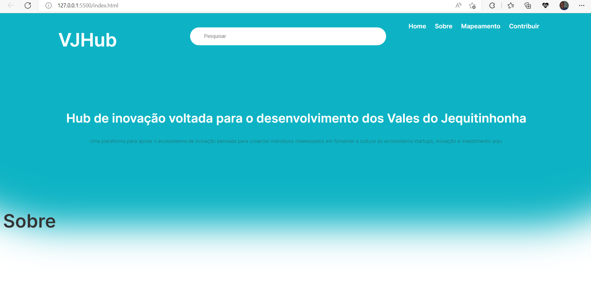

### VJHub - TCC

O EMPREENDEDORISMO NO ÂMBITO DA UFVJM: PROPOSTA DE UMA  PLATAFORMA DIGITAL PARA APOIO A UM ECOSSISTEMA DE EMPREENDEDORISMO NO VALE DO JEQUITINHONHA

**Objetivo:** investigar o contexto local e mapear ações para fomentar o empreendedorismo universitário. Visando nortear as ações para alcançar o objetivo geral, foram definidos objetivos específicos, sendo eles:

1) Identificar a percepção dos discentes sobre a atuação da UFVJM voltada ao empreendedorismo.

2) Mapear possíveis agentes que podem constituir um hub voltado ao empreendedorismo universitário no contexto da UFVJM. 

3) Propor uma plataforma digital que apoie a formação do hub de apoio ao empreendedorismo universitário.

**Orientadora:** [Cinthya Rocha Tameirão](http://lattes.cnpq.br/1803639070330678)

#### Resumo

**Header da primeira página**

